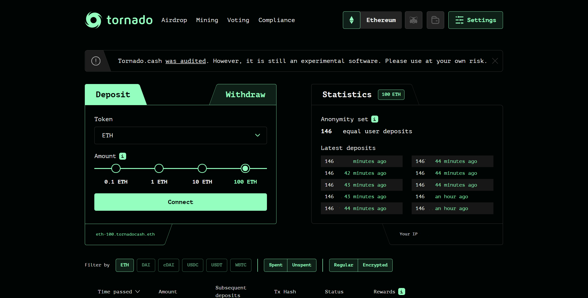

# Minería de anonimato

El minado de anonimato o _anonymity mining_ es un incentivo para incrementar el nivel de privacidad para cualquier protocolo de _coin-joining_ o _coin-mixing_ mediante la recompensa a los participantes con puntos de anonimato (AP - anonymity points) dependiendo del tiempo que mantengan sus activos en una pool.

_Este incentivo empezó el 18 de diciembre de 2020 y acabará el 18 de diciembre de 2021._

Los depósitos individuales en cualquier pool de anonimato permitidas (ETH, WBTC, DAI or cDAI) y que se recompensa con una cantidad fija de AP por bloque, durante su periodo de depósito permanece en la pool. Estos puntos se pueden intercambiar por TORN una vez reclamados.

### _Anonymity points_ (AP)

_Los lectores deben saber que algunos depósitos de cantidades bajas en el momento de esta escritura, no producen un rendimiento positivo debido al coste de gas requerido para retirar, canjear y cambiar los anonymity points_

Uno de los miembros de la comunidad creó un recurso de [hoja de minado 13](https://torn.community/t/anonymity-mining-spreadsheet/720) que ayuda a calcular el porcentaje de rendimiento anual (APY) para cada pool y cada cantidad fijada, estimando las comisiones requeridas para reclamar la recompensa. **Es muy recomendable revisar este recurso y planificar sus acciones antes de esperar un retorno con cierto rendimiento.** Al final de la hoja de cálculo, usted puede ver cada pool seleccionando la pestaña asociada.

### ¿Cómo ganar AP?

1\. Decida que cantidad y activo va a depositar seleccionándolo mediante el menú desplegable, antes de hacer clic en "Connect" y "Deposit".

2\. Haga una copia de su nota de depósito y guárdela en un lugar seguro, **no comparta esto con nadie, o pondrá en riesgo su depósito y su recompensa.**

3\. Genere la prueba y envíe la transacción.

4\. Su depósito debería ahora ser visible en el inferior de la página, puede seguir cuánto AP gana ahí; recuerde que cuanto más tiempo permanece su depósito activo, más AP ganará.

_Las Notas que están activas (no retiradas) se conocen como notas de tipo "unspent"._

### ¿Cómo reclamar AP?

1\. Primero debe crear una cuenta de minado y guardar sus credenciales on-chain para su recuperación fácil (requiere una transacción), **al igual que con las notas, usted nunca debe compartir su clave de recuperación de minado con nadie** y asegúrese de guardarla en un lugar seguro. Esta característica no está respaldada por los monederos hardware, por lo que se recomienda guardar la información como se presenta.

2\. Tome un depósito activo presentando una nota _unspent_ y retire a una dirección de su preferencia y decida si usa un retransmisor (_relayer_) o no (para mantener el anonimato en un depósito siempre se recomienda usar un relayer), esto llevara la nota a un estado de "spent" ("gastado").

**Recuerde quedarse sus notas de depósito en secreto incluso después de su retirada, ya que todavía tienen la habilidad de reclamar AP.**

3\. Visite la ruta de minado de la aplicación e introduzca su nota "spent", puede encontrarse con una de las situaciones siguientes.

* **La habilidad de reclamar su **_**spent note**_: haga clic en el botón `Claim reward` y envíe la transacción con un relayer o no, una vez se haya confirmado, su balance de AP debería actualizarse para reflejar la acción.

&#x20;

* **La inhabilidad de reclamar su **_**spent note**_: _“Warning: The note is not yet ready for anonymity mining. You can wait few days before trying again”_ - Esto significa que el árbol de Merkle no están sincronizados y se requiere una transacción para actualizarlos.

Actualizar los árboles puede ser un proceso costoso, **se recomienda que los usuarios con pequeñas cantidades depositadas esperen a que un minero con mas peso actualice el árbol, esto puede llevar de unos días a una semana**. Si usted quiere ver su evento relativo a los lotes pendientes actuales. Haga clic en _"Show mining note information"_ hyperlink, ahi puede también pagar las comisiones de transacción par sincronizar el árbol relativo a su retiro mediante el botón `Update trees`.

### ¿Cómo cambiar AP?

1\. Navegue a la pestaña de "Swap" en la página de minado, a la que puede acceder a través de la segunda barra de navegación desde el borde superior de la página.

2\. Introduzca la cantidad de AP que quiere cambiar o seleccione la opción "Maximum" para convertir su balance activo total. Bajo esta entrada, información sobre el cambio actual AP/TORN y la recompensa de salida será mostrada. Proporcione una dirección de preferencia para recibir la recompensa, finalice generando la prueba y enviando la transacción mediante un relayer o no.

3\. Si ha seguido todos los pasos correctamente, tokens TORN se transferirán a la dirección de preferencia proporcionada en el paso 2 de esta sección.

### Observaciones finales

Felicidades, ha participado de forma exitosa en _anonymity mining_!

Siempre es recomendable planificar cuando decide minar cualquiera de los conjuntos, los usuarios deben también tener en cuenta que el cambio [AP/TORN](https://duneanalytics.com/luckyallocator/Daily-AP-TORN-Rate-v2) depende de la oferta y la demanda, por lo que **a más gente reclame, mayor será la relación de cambio, y viceversa; como menos se reclame, menor será la relación**.

Para más información en anonymity mining, indague en los recursos siguientes (inglés):

* [Tornado.Cash governance proposal article](https://tornado-cash.medium.com/tornado-cash-governance-proposal-a55c5c7d0703)
* [Tornado.Cash anonymity mining optimisation article](https://tornado-cash.medium.com/gas-price-claimed-anonymity-mining-a-victim-but-now-everyone-can-claim-ap-5441aaa32a1a)&#x20;
* [Anonymity mining explained (technical)](https://torn.community/t/anonymity-mining-technical-overview/15)

_Agradecimientos a_ [_@sockawoo_](https://torn.community/u/sockawoo) _y_ [_@ethdev_](https://torn.community/u/ethdev) _por la ayuda en la revisión_

_Escrito por_ [_**@xgozzy**_](https://torn.community/u/xgozzy/summary)

_Traducido por_ [_@EeXavi_](https://twitter.com/EeXavi?s=09)
