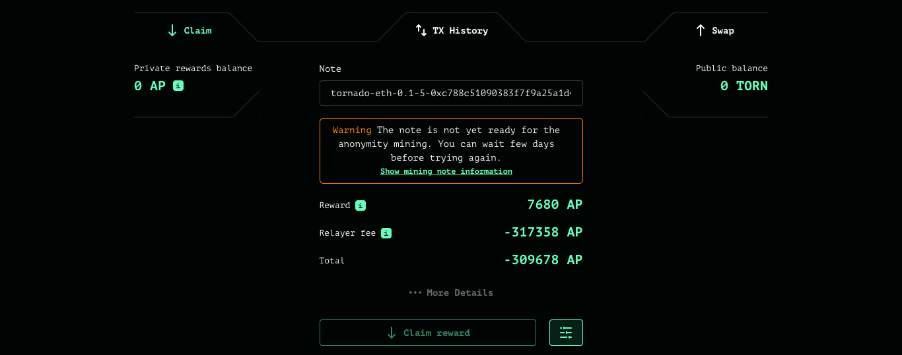

# Anonymity mining

Anonymity mining is an incentive to increase the level of privacy in any coin-joining or coin-mixing protocols by rewarding participants anonymity points \(AP\) dependent on how long they hedge their assets in a pool.

_This incentive began on December 18, 2020 and will end on December 18, 2021._

Individuals deposit to any one of the anonymity pools that are supported \(ETH, WBTC, DAI or cDAI\) and are rewarded a fixed amount of AP per block, over the period their deposit remains in the pool. These points can then be exchanged for TORN once claimed.

### Anonymity points \(AP\)

_Readers should be aware some lower denomination deposits at the time of writing, do not produce a positive return due to the gas costs required to withdraw, redeem and exchange anonymity points_

One of the community members created the resource of [a mining spreadsheet 13](https://torn.community/t/anonymity-mining-spreadsheet/720) that helps calculate annual percentage yield’s \(APY’s\) for each pool and each denomination set within, through estimating the fees required to claim a reward. **It is highly recommended to view this resource and plan one’s course of action before expecting to earn yield.** At the bottom of the spreadsheet, you can view each pool by selecting the associated tab.

### How to earn AP

1. Decide what amount and asset to deposit by selecting it through the dropdown menu, before clicking on "Connect" and "Deposit".

2. Take a record of your depositing note and back it up safely, **do not share this with anyone or risk losing your deposit and reward.**

3. Generate the proof and submit the transaction.

4. Your deposit should now be viewable on the bottom of the page, you can track how much AP it earns here; remember the longer your deposit remains active, the more AP you earn.

_Notes that are active \(not withdrawn\) are known as “unspent” notes._

### How to claim AP

1. First you must create a mining account and store those credentials on-chain for easy recovery \(requires a transaction\), **like depositing notes, you should never share your mining recovery key with anyone** and ensure to back it up in a safe place. This feature is not supported by hardware wallets so it’s encouraged to store the information as presented_._

2. Take an active deposit through providing an unspent note and withdraw to an address of preference and decide whether to use a relayer or not \(_to maintain a deposit’s anonymity it is always advised to use a relayer_\), this will bring the note into a “spent” state.

**Remember to still keep your depositing notes a secret even after withdrawing, as they still retain the ability to redeem AP.**

3. Visit the mining route of the application and enter your spent note, you may be faced with one of the following situations.

* **The ability to claim your spent note**: click the “Claim reward” button and submitting the transaction either by using a relayer or not, once confirmed your AP balance should update to reflect the action.

 

* **The inability to claim a spent note:** _“Warning: The note is not yet ready for anonymity mining. You can wait few days before trying again”_ - This means the Merkle trees are out of sync and require a transaction to be updated.

Updating the trees can be an expensive process, **it is recommended that users with small deposits wait for the larger miners to update the trees, this could take anywhere from a few days to a week**. If you want to view your event relative to the current pending batches. Click the _“Show mining note information”_ hyperlink, here you can also pay the transaction fees to sync the tree relative to your withdrawal through the “Update trees” button.

### How to exchange AP

1. Navigate over to the “Swap” tab on the mining page which can be accessed through the second navigation bar from the top of the page.

2. Enter the amount of AP requested to exchange or select the “Maximum” option to convert your active balance. Below this input, information regarding the current AP/TORN rate and reward output will be displayed. Provide an address of preference to receive the reward, finalise by generating the proof and submitting the transaction through a relayer or not.

3. If all steps were followed correctly, TORN will be transferred to the address of preference provided in step 2 of this section.

### Closing remarks

Congratulations, you have successfully participated in anonymity mining!

It is always recommended to plan when deciding to mine any of the anonymity sets, users should also be aware that the [AP/TORN rate](https://duneanalytics.com/luckyallocator/Daily-AP-TORN-Rate-v2) is dependent on supply and demand, therefore, **the more people that claim the higher the rate becomes, and the less people that claim the lower it becomes**.

For more information on anonymity mining, seek the following resources:

* [Tornado.Cash governance proposal article](https://tornado-cash.medium.com/tornado-cash-governance-proposal-a55c5c7d0703)
* [Tornado.Cash anonymity mining optimisation article](https://tornado-cash.medium.com/gas-price-claimed-anonymity-mining-a-victim-but-now-everyone-can-claim-ap-5441aaa32a1a) 
* [Anonymity mining explained \(technical\)](https://torn.community/t/anonymity-mining-technical-overview/15)

_Regards to_ [_@sockawoo_](https://torn.community/u/sockawoo) _and_ [_@ethdev_](https://torn.community/u/ethdev) _for assisting in peer-reviewing_

_Written by_ [_**@xgozzy**_](https://torn.community/u/xgozzy/summary)\_\_

