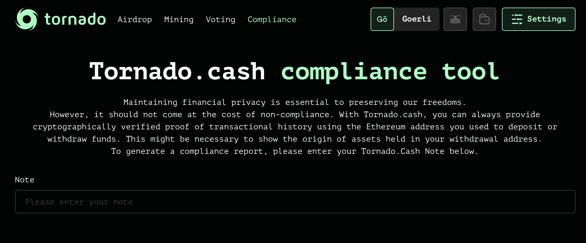
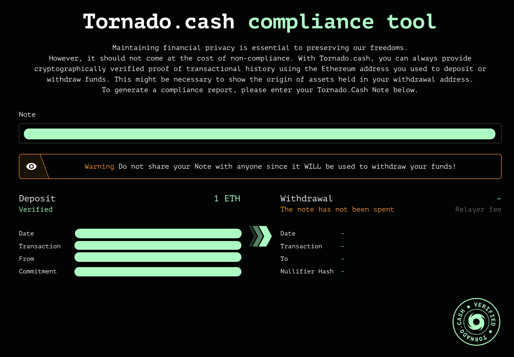
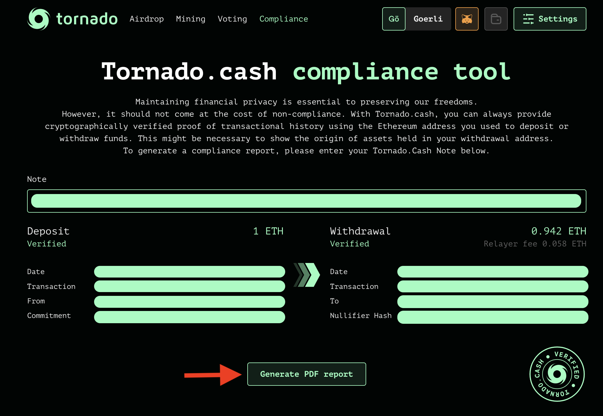
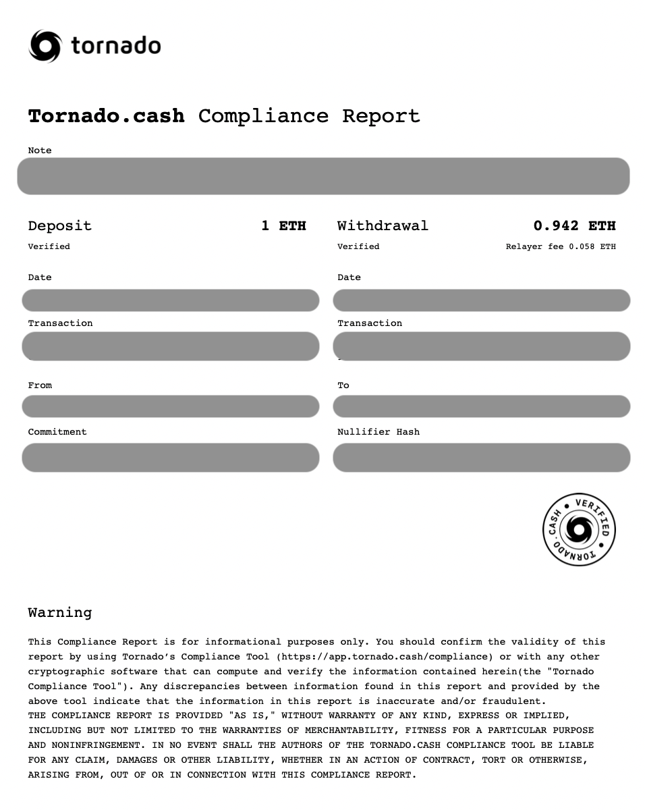

# Herramienta de Cumplimiento Normativo

Por diseño, todo es público en la blockchain, lo cual priva al usuario de su derecho a la privacidad. Cualquiera puede tener acceso al historial completo de transacciones. Como respuesta a este problema fundamental, el protocolo Tornado.Cash permite a los propietarios de cryptodivisas recuperar su privacidad y ganar en anonimato. En efecto, permite a los usuarios romper el nexo on-chain entre direcciones origen y destino.

No obstante, mantener la privacidad y preservar la libertad financiera no debería ocurrir a expensas del incumplimiento normativo. El derecho a la privacidad implica la capacidad de controlar la información que revelamos y a quién la revelamos.

En esta medida, **La Herramienta de Cumplimiento Normativo de Tornado.Cash permite al usuario probar el origen de sus fondos.** Gracias a la nota generada después de cada depósito, **esta herramienta genera una prueba cryptográficamente verificada del historial de transacciones** utilizando la dirección Ethereum empleada en el depósito y retiro de los activos.

Puede visitar en Medium el articulo relacionado con esta herramienta para aprender más sobre su desarrollo y puesta en marcha: [**Tornado.Cash compliance Medium Post**](https://tornado-cash.medium.com/tornado-cash-compliance-9abbf254a370).

En conclusión, si usted necesita en alguna ocasión probar el origen de activos retirados de alguna pool de Tornado.Cash, le invitamos a usar la siguiente [Herramienta](https://app.tornado.cash/compliance/):

## ¿Cómo usar la Herramienta de Cumplimiento Normativo?

Con cada depósito realizado con [Tornado.Cash app](https://app.tornado.cash), una nueva Nota es generada por el protocolo. Esta Nota es necesaria para retirar los activos depositados posteriormente a cualquier dirección de retiro. Es la misma Nota que, si fuera necesario, permite al usuario generar el Informe de Cumplimiento Normativo (_Compliance Report_) para probar el origen de sus activos.

_Más información sobre cómo depositar y retirar activos en Tornado.Cash a su disposición en: _[_Deposit & Withdraw_](https://app.gitbook.com/s/-MXflGk4w5pDjjlmPCuF-1769347644/untitled.md)_._

Para obtener el Informe de Cumplimiento Normativo, el usuario solamente necesita copiar la Nota, generada después del depósito, en el cuadro dedicado.

### Antes del retiro

Si la Nota no se ha consumido todavía (p.e. los activos no se han retirado todavía), la Herramienta de Cumplimiento solamente le entregará información sobre el depósito:

* Hash de la transacción de depósito;
* Dirección de origen;
* Hash del _commitment_.

El _commitment_ es el hash aleatorio del área de bytes generada en cada depósito que se envía al smart contract de Tornado.Cash para caracterizar la transacción.

_Puede encontrar más información sobre cómo Tornado.Cash consigue darle privacidad leyendo_ [_How does Tornado.Cash work?_](https://app.gitbook.com/s/-MXflGk4w5pDjjlmPCuF-1769347644/how-does-tornado.cash-work.md)

### Después del retiro

Si la Nota ya se ha usado (p.e. los activos se retiraron a una dirección utilizando la Nota), la Herramienta de Cumplimiento completará la información anterior añadiendo:

* Hash de la transacción de retiro;
* Dirección de destino;
* Hash del _nullifier_.

El hash del _nullifier_ es un parámetro público que se envía on-chain para ser comprobado con el smart contract y el árbol de datos de Merkle para permitir el retiro.

En conclusión, la herramienta permite a los usuarios rehacer la conexión entre direcciones origen y destino con el propósito de probar el historial de transacción de criptodivisas utilizadas en Tornado.Cash.

Esta información se puede descargar en formato PDF, facilitando su envío a terceras partes:

_Escrito por_ [_**@ayefda**_](https://torn.community/u/ayefda)__\
_Traducido por_ [_@EeXavi_](https://twitter.com/EeXavi?s=09)
